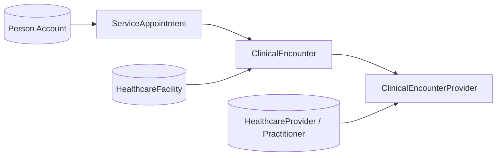

# Booking pattern — ServiceAppointment ↔ ClinicalEncounter ↔ ClinicalEncounterProvider

This document is the **single implementation contract** for **`HC_Book_Appointment`**, **`HC_Modify_Appointment`**, and **`HC_Cancel_Appointment`**. It aligns with `docs/Data-Model-Objects-And-Fields.md` and `docs/Dev-QA-Backlog.md` (Epic 1.2 / 2.4).

**Goals**

- One **scheduling** row (`ServiceAppointment`) and one **clinical visit** row (`ClinicalEncounter`) stay in sync for demos and automation.
- **Attending provider** is captured on `ClinicalEncounterProvider` when a specific doctor is chosen.
- **No orphaned records**: if a downstream step fails, do not leave a half-linked chain (use fault paths, compensating deletes, or all-or-nothing order—see §4).

**Patient linkage:** `patientAccountId` for **`BOOK`** / **`MODIFY`** / **`CANCEL`** is always a **`Person Account`**. For **returning** guests it comes from **`HC_Resolve_Patient_By_Phone`**; for **new** guests (after capture) it comes from **`HC_Create_Guest_Person_Account`** *(planned)* — **Lead is not used** (see `docs/Patient-Agent-Conversation-Scripts.md` §4a).

**Non-goals**

- Full inpatient admission, transfer, or billing workflows.
- Replacing org-specific **picklist API values** — you must confirm those in Setup or Describe for your org (§7).

---

## 1. Canonical object chain

| Role | Object | Purpose |
|------|--------|---------|
| **Schedule / capacity / reminders** | `ServiceAppointment` | Field Service–style appointment; drives slots, `SchedStartTime` / `SchedEndTime`, cancel/modify UX, `CheckedInTime` if used. |
| **Clinical visit header** | `ClinicalEncounter` | Health Cloud visit tied to **patient** and **facility**; links back to the SA. |
| **Attending line** | `ClinicalEncounterProvider` | Links **one encounter** to **one practitioner** for the visit window (optional for “department-only” if your org/policy allows deferring provider assignment). |

---

## 2. Field mapping (happy path — book)

Use the **same start/end** on SA and CE for MVP unless product requires otherwise.

### 2.1 ServiceAppointment (`ServiceAppointment`)

| Field | Source / rule |
|-------|-----------------|
| `AccountId` | **Person Account Id** when the field is writeable; in some orgs it is **read-only** on `ServiceAppointment`—then set **`ContactId`** to the patient’s **`PersonContactId`** only (see repo **`HC_BookingActionsInvocable`**). |
| `ContactId` | **PersonContactId** from the patient Person Account (used for patient linkage and MODIFY/CANCEL ownership checks when `AccountId` is not set on SA). |
| `SchedStartTime` / `SchedEndTime` | User-selected slot; **must** be in the future at booking time; end after start. |
| `Status` | Set to your org’s **scheduled** (or equivalent) API value — **confirm** in org (§7). |
| `StatusCategory` | Set only if writeable; otherwise omit and let the platform derive from **Status**. |
| `Subject` | Short neutral label, e.g. `Outpatient consult - Medical Oncology` (avoid PHI). |
| `Phone` | Optional copy of mobile used for the session. |
| `ParentRecordId` | **This repo’s Apex** sets **`ParentRecordId`** = **`patientAccountId`** (Person Account). If your org requires a different parent (e.g. work order), adjust **`HC_BookingActionsInvocable`** and update this doc. |
| `WorkTypeId` | **Optional** — pass only if your org ties visit length or validation to **`WorkType`**. **Hackathon slot path** does not depend on **`WorkType`**. |
| `ServiceTerritoryId` | **Not used** in the hackathon slot + **BOOK** design; omit unless a validation rule forces it. |
| `AttendeeLimit` / `AttendeeCount` | **Not used** for hackathon capacity (use **`Max_Daily_Appointments__c`** + encounter count instead). |

### 2.2 ClinicalEncounter (`ClinicalEncounter`)

| Field | Source / rule |
|-------|-----------------|
| `PatientId` | **Person Account Id** of the patient (same logical patient as the SA’s `ContactId` / `AccountId`). |
| `FacilityId` | `HealthcareFacility` Id where the visit occurs (must match chosen facility for directory integrity). |
| `StartDate` / `EndDate` | Align with `SchedStartTime` / `SchedEndTime` (timezone-aware). |
| `Status` | **Scheduled** (or org equivalent) at creation. |
| `ServiceAppointmentId` | **Id of the row created in §2.1** (after SA insert succeeds). |

Other HC fields (`Category`, `TypeId`, etc.) — populate only if required by validation rules or layouts; otherwise leave default for hackathon.

### 2.3 ClinicalEncounterProvider (`ClinicalEncounterProvider`)

| Field | Source / rule |
|-------|-----------------|
| `ClinicalEncounterId` | Id of **§2.2** encounter. |
| `PractitionerId` | **Practitioner** record Id for the chosen doctor (type is org-defined — often `Contact` Id behind `HealthcareProvider.PractitionerId`; **describe** the field in your org). |
| `StartDate` / `EndDate` | Optional; default to encounter `StartDate` / `EndDate` for MVP. |

**Department-only booking (no named doctor)**

- **Pattern A (recommended):** Flow still picks a **concrete** `HealthcareProvider` (e.g. round-robin / first available from `HealthcarePractitionerFacility` for facility + specialty) and creates **one** `ClinicalEncounterProvider` row.
- **Pattern B:** Create **SA + CE** only; staff assigns provider in EMR later — only if **no** validation requires CEP at creation.

---

## 3. Create order & fault handling (book)

Recommended **insert order** to satisfy lookups and avoid dangling rows:

1. **Validate** inputs (patient resolved, facility exists, slot in future, optional capacity check vs `HealthcareFacility.Max_Daily_Appointments__c` + same-day SA count).
2. **Insert `ServiceAppointment`** (capture new `Id`).
3. **Insert `ClinicalEncounter`** with `ServiceAppointmentId` = SA Id.
4. **Insert `ClinicalEncounterProvider`** when Pattern A applies.

**On failure after step 2**

- If CE insert fails: **delete** the SA created in step 2 *or* mark SA as canceled with internal reason (prefer delete for clean demos if allowed).
- If CEP insert fails: **delete** CE and SA (or escalate to manual cleanup policy). Document what your flow does.

**Idempotency**

- Optional: pass a **correlation** or **external id** into `Agent_Action_Log__c` only; Salesforce core rows do not require it unless you add custom external Id fields.

---

## 4. Modify appointment (`HC_Modify_Appointment`)

1. Resolve **existing** `ServiceAppointment` (by Id or by patient + datetime window — be strict to avoid wrong row).
2. Update **`SchedStartTime` / `SchedEndTime`** (and `Subject` if needed).
3. Update **linked `ClinicalEncounter`** (`StartDate` / `EndDate`) via `ServiceAppointmentId` relationship.
4. Update **`ClinicalEncounterProvider`** start/end if you keep them in sync.

**Rules**

- Do not modify **canceled** or **completed** visits unless product explicitly allows reschedule-from-terminal-state.

---

## 5. Cancel appointment (`HC_Cancel_Appointment`)

1. Resolve SA; verify patient ownership (same Account).
2. Set **`ServiceAppointment.Status`** / **`StatusCategory`** to canceled values; set **`CancellationReason`** when the picklist requires it.
3. Set **`ClinicalEncounter.Status`** to canceled (or parallel terminal state).
4. Optionally delete or cancel **`ClinicalEncounterProvider`** rows — follow org convention (soft cancel vs delete).

**Reminders**

- If **`HC_Reminder_Before_Visit`** is scheduled off SA/CE dates, cancel should prevent duplicate sends (filter on status in reminder entry criteria).

---

## 6. Capacity (“slots remaining”)

Optional demo logic (see data dictionary):

- Compare **count** of `ServiceAppointment` rows for a given **`HealthcareFacility`** (via linked encounter or SA location strategy) on a calendar day to **`HealthcareFacility.Max_Daily_Appointments__c`**.
- Enforce in **`HC_Book_Appointment`** before insert: if at cap, return a **friendly fault** (no SA created).

Exact facility linkage on SA may use **territory**, **address**, or **related encounter** — choose one consistent rule and document it in the flow description.

---

## 7. Org discovery checklist (before you wire picklists)

Run through Setup or a quick describe and **write down API values** your flows will set:

| Question | Where to confirm |
|----------|------------------|
| Required SA fields on create? | Object Manager → `ServiceAppointment` → required fields; try one manual create in UI. |
| `ParentRecordId` allowed types? | Same; note whether **Work Order**, **Case**, or other parent is mandatory. |
| `Status` + `StatusCategory` API values for scheduled / canceled / completed? | Picklists on `ServiceAppointment`. |
| `ClinicalEncounter.Status` values for scheduled / canceled? | Picklists on `ClinicalEncounter`. |
| `ClinicalEncounter.PatientId` target types? | Field definition (Account vs Contact). |
| `ClinicalEncounterProvider.PractitionerId` target type? | Field definition (Contact vs HealthcareProvider — **varies by release**). |
| `CancellationReason` required when canceled? | Validation rules + picklist. |

Paste the resulting mini-table into an internal wiki or flow annotations so deploys stay repeatable.

---

## 8. Invocable flow contract (suggested inputs)

These names are suggestions; keep them stable for **Agentforce actions**.

### `HC_Book_Appointment`

| Input | Required | Notes |
|-------|----------|--------|
| `patientAccountId` | Yes* | *Or resolve from `patientMobile` via subflow first. |
| `healthcareFacilityId` | Yes | Visit site. |
| `schedStart` / `schedEnd` | Yes | Datetime. |
| `healthcareProviderId` | No | If null, use **department-only Pattern A** selection. |
| `specialtyOrDepartmentKey` | No | Used when provider is null. |
| `correlationId` | No | For `Agent_Action_Log__c`. |

**Output:** `serviceAppointmentId`, `clinicalEncounterId`, `clinicalEncounterProviderId` (nullable), `message` / fault.

### `HC_Modify_Appointment`

| Input | Required |
|-------|----------|
| `serviceAppointmentId` | Yes |
| `patientAccountId` | Yes (verify ownership) |
| `newSchedStart` / `newSchedEnd` | Yes |

### `HC_Cancel_Appointment`

| Input | Required |
|-------|----------|
| `serviceAppointmentId` | Yes |
| `patientAccountId` | Yes |
| `cancellationReason` | If picklist requires |

---

## 9. Slot discovery → patient choice → BOOK (planned)

**Current repo behavior:** **`HC_BookingActionsInvocable`** **`BOOK`** requires **`schedStartOrNewStart`** and **`schedEndOrNewEnd`** chosen by the agent/patient; it does **not** compute free slots.

**Target behavior (29 Apr freeze):**

1. **Suggest slots** — Call **`HC_SlotSuggestionInvocable`** (planned) with **`healthcareFacilityId`**, optional **`healthcareProviderId`**, **`targetDate`**, slot length. **Data model:** **`OperatingHours`**/**`TimeSlot`** (+ **`HealthcareFacility.OPD_Operating_Hours__c`** or **`HealthcarePractitionerFacility.OperatingHoursId`**) minus overlapping **`ClinicalEncounter`** / **`ServiceAppointment`**, respect **`Max_Daily_Appointments__c`**. **Not in scope:** FSL **`AppointmentBookingService`**, territories, **`ServiceResource`** graphs — see **`docs/Data-Model-Objects-And-Fields.md`** § *Hackathon: slot finding & booking*.
2. **Present options** — Agent lists **numbered** choices and/or **JSON** for an **LWC** card list on Experience (see data dictionary § LWC contract).
3. **BOOK** — Map selection to concrete datetimes; call existing **`HC_BookingActionsInvocable`** **`BOOK`** with the same **`patientAccountId`**, **`healthcareFacilityId`**, **`healthcareProviderId`**, **`schedStartOrNewStart`**, **`schedEndOrNewEnd`**.

**Symptom routing (separate path):** **`Symptom_Specialty_Map__c`** + **`HC_SymptomRoutingInvocable`** (planned) → derive **`specialtyName`** → existing **`HC_DirectoryInvocable.findSpecialists`** → user picks facility/provider → slot discovery → **BOOK**.

---

## 10. Related documents

| Doc | Use |
|-----|-----|
| `docs/Data-Model-Objects-And-Fields.md` | Field-level scope, scheduling strategies |
| `docs/Patient-Agent-Conversation-Scripts.md` | UX + verification |
| `docs/Org-Build-Checklist.md` | Sequencing & status |
| `docs/Dev-QA-Backlog.md` | TC2.4a–c acceptance tests |
| `docs/HC-Automations.md` | Flows + Apex live today vs booking (next) |

---

*Revision: initial hackathon pattern. Update §7 when your org’s picklist API values and required parents are finalized.*
